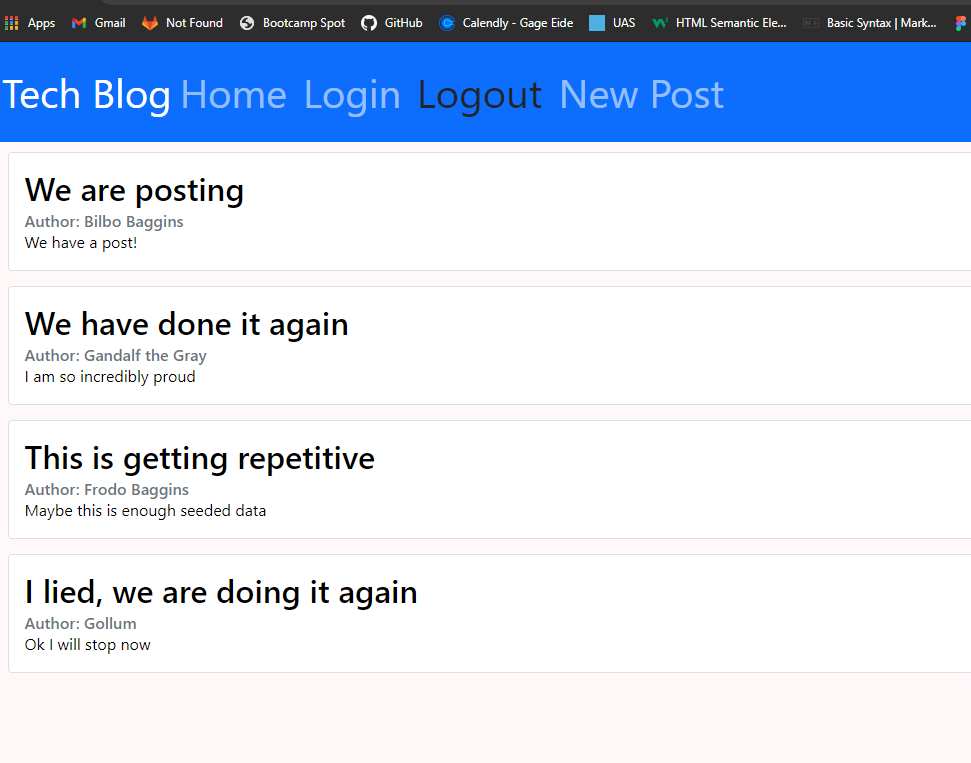
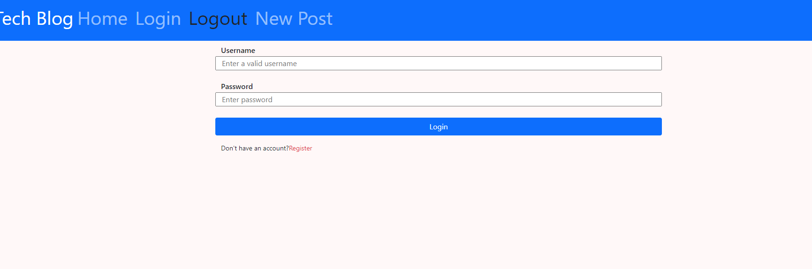
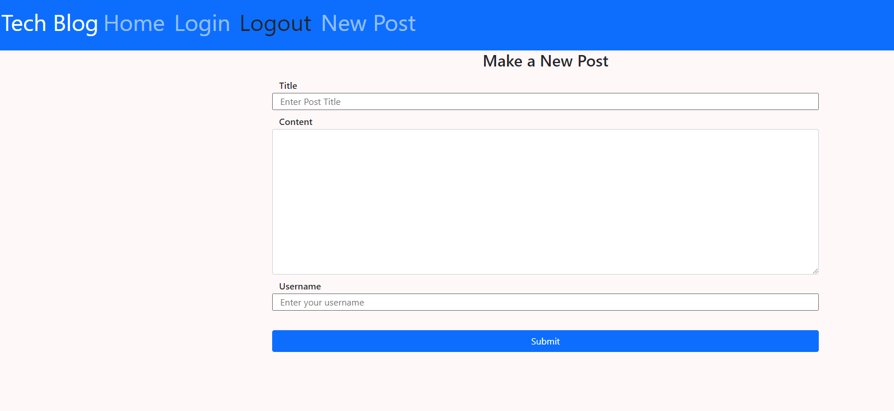

# techBlog

  
#### Table of Contents
* [Project Description](#project-description)
* [Installation Instructions](#installation-instructions)
* [Usage Information](#usage-information)
* [Contributor Guidelines](#contributor-guidelines)
* [Code of Conduct](#code-of-conduct)
* [License](#license)
* [Test Instructions](#test-instructions)
* [Questions](#questions)
* [Deployment Image](#deployment-image)

## Project Description
* To build a CMS-style blog site similar to a Wordpress site, where developers can publish their blog posts and comment on other developers’ posts as well. This app follows the MVC paradigm in its architectural structure, using Handlebars.js as the templating language, Sequelize as the ORM, and the express-session npm package for authentication.

## Installation Instructions
* Express
* MySQL
* Sequelize
* Path
* express-session
* express-handlebars
* connect-session-sequelize
* bcrypt
* 

## Usage Information
* This app follows the MVC paradigm in its architectural structure, using Handlebars.js as the templating language, Sequelize as the ORM, and the express-session npm package for authentication.

## Contributor Guidelines
* Contribution rules are under the Code of Conduct section

## Code of Conduct
* [Contributor Code of Conduct](https://www.contributor-covenant.org/version/2/0/code_of_conduct/code_of_conduct.md)

## Test Instructions
* No test required

## License
* MIT License

## Questions
* For additional help or questions about collaboration, please reach out to jpodell21@gmail.com
* Follow me on Github at [JamesO1231](http://github.com/JamesO1231)

## Deployment Image

